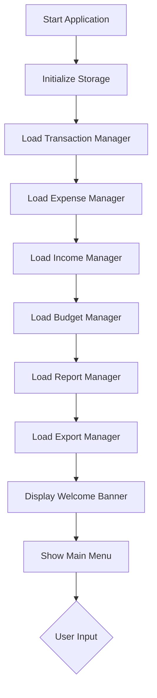
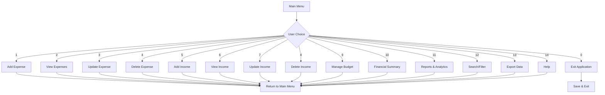
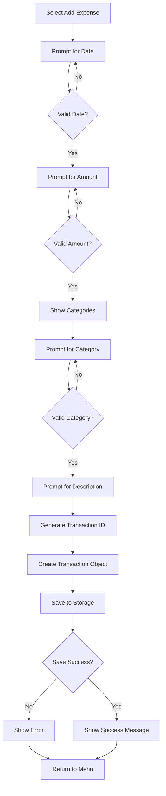
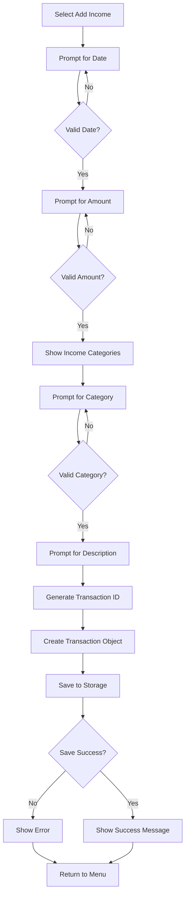
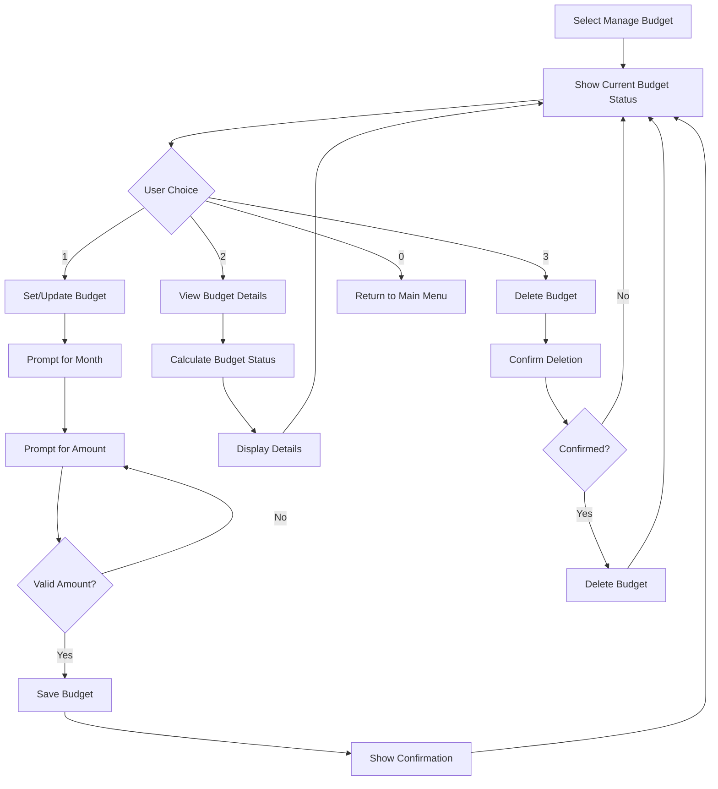
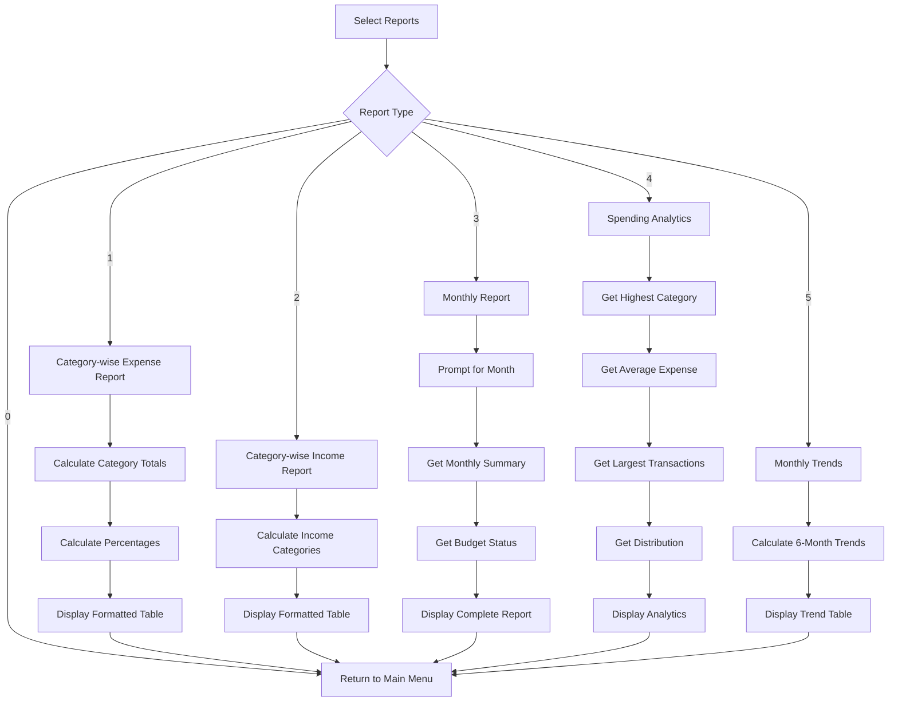
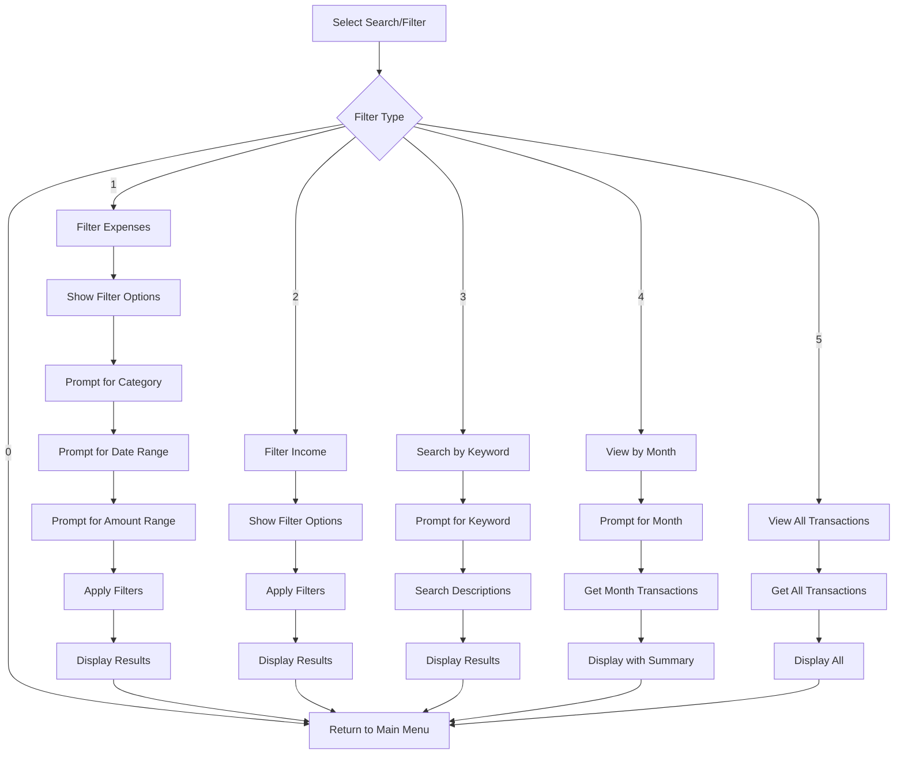
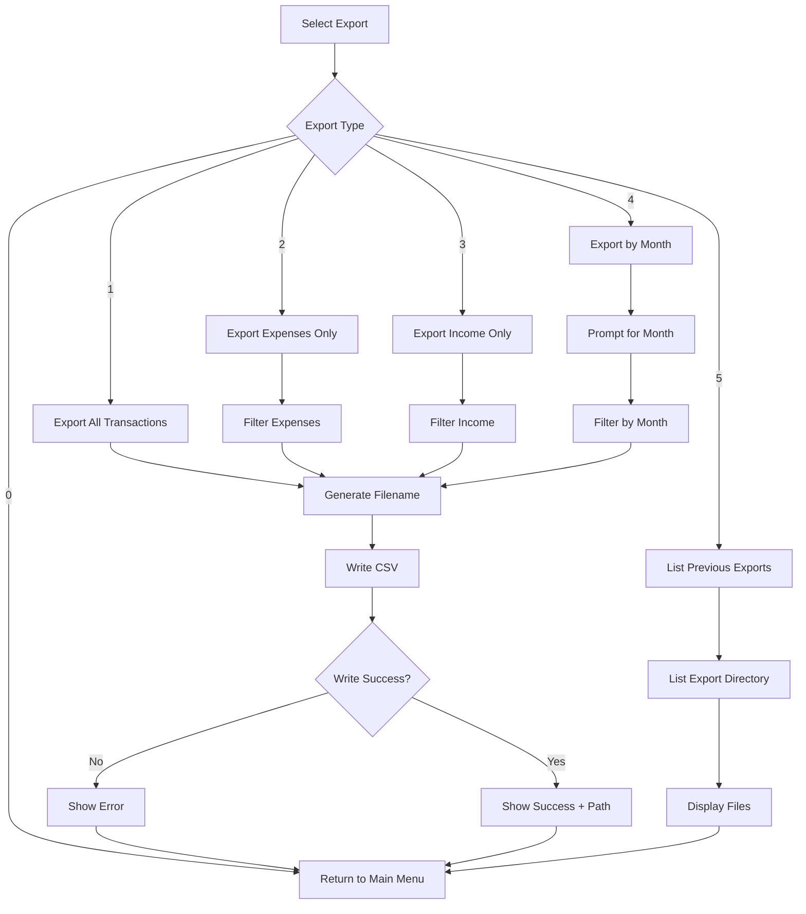
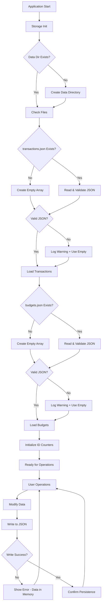
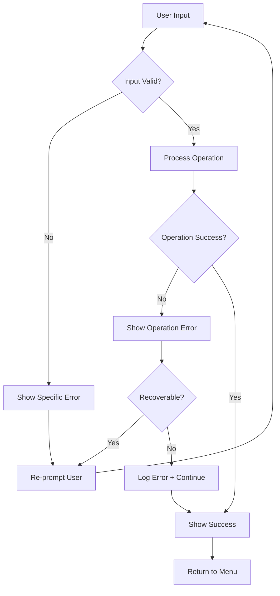

# Workflow Documentation

## Application Startup Flow

## Main Menu Navigation

## Add Expense Workflow

## Add Income Workflow

## Budget Management Workflow

## Reports & Analytics Workflow

## Search & Filter Workflow

## Export Data Workflow

## Data Persistence Workflow

## Error Handling Flow

## Key Workflow Principles

1. **Validation First**: All inputs validated before processing
2. **Graceful Degradation**: Errors don't crash the app; user returns to menu
3. **Confirmation for Destructive Actions**: Delete operations require explicit confirmation
4. **Immediate Feedback**: Success/error messages shown after every operation
5. **Persistent State**: Data saved after every successful operation
6. **Clean Navigation**: Consistent return to previous menu after operations
7. **Empty State Handling**: Clear messages when no data exists